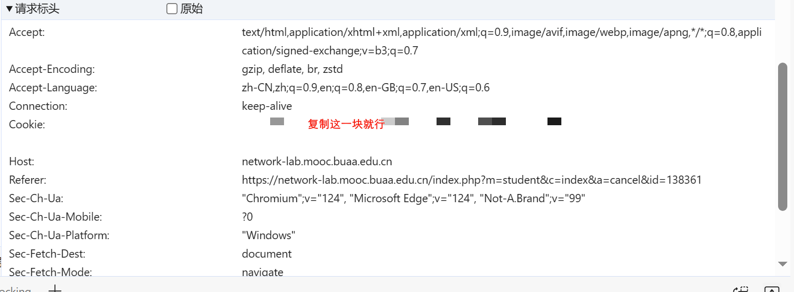
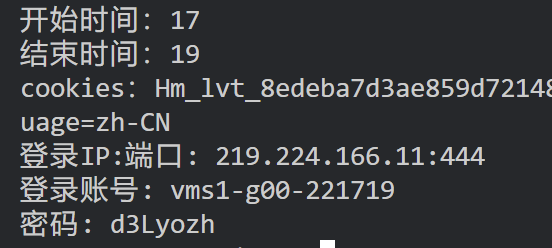

# BUAA-jwsy-bookingScripts
输入预约时间后直接告诉你账号密码！帮你节省一分钟的挑选实验室时间（

## 使用方法     
运行`main.py`，控制台输入预约时间和你的cookie。     

网站的会话会定时过期，需要手动登录一下再运行该脚本。听上去有些脱裤子放屁是不是，但是只要告诉自己，这样就没必要单独保存cookie而是需要的时候登陆一下去复制是不是就好接受了（            
因为~~本人jwsy结课了~~登录有验证码所以没打算做自动化，不过反正账号密码验证码都是明文传输的，验证码的图片`id='verifyImg'`，有心之人或许能机器学习整个纯自动化登录出来，期待（          

运行脚本后，在控制台按照提示输入预约日期和预约时段，预约日期留空表示当天，格式为`mm-dd`，不能超过往后八天。    

如果需要预约Linux系统，将`book.py`的`data`中的`system`字段修改为1即可，因为事实上大部分时间都不需要约Linux，所以手动输入反而影响效率。

cookie用字符串就行：      

## 运行示例        

